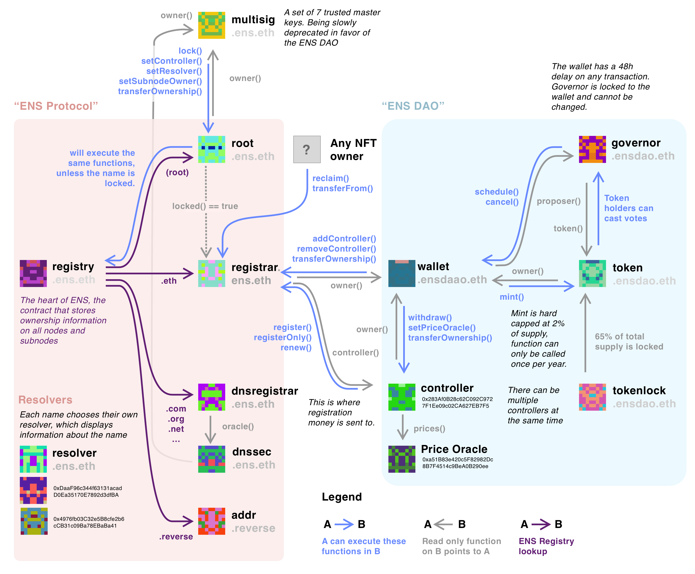

ENS是一个由多个合约组成的系统。这种模块化的特性允许随着时间的推移而构建(或删除)功能。尽管一切都依赖于简单且稳定的 ENS 注册表，但其他模块的逐步添加、升级和更迭，反映了 ENS 不断演变的生态系统。

这个分布图可以分为两部分: ENS 协议和 ENS DAO。

### ENS 协议

该系统的核心是ENS注册表，它已部署在所有以太坊测试链上（并使用一个允许它部署在任何其他 EVM 兼容链上的脚本），并且可以在所有链上的指定地址 0x00000000000C2E074eC69A0dFb2997BA6C7d2e1e 上找到。这是一个相对简单的合约：根节点的所有者可以为不同的子节点创建所有者。然后，这些所有者可以为节点设置解析器，或与其他所有者一起创建其他子节点。

在以太坊主网上，根节点的所有者（可以在注册表内查询 id 为 0x0 的节点获得）是根管理合约。以下是主要节点及其相关合约的所有者：

* **根管理 (root.ens.eth)** 这是根域的简单访问控制。它作为 ENS 注册表的接口，同时也支持锁定某些名称。一旦锁定，所有者就无法解锁。在撰写本文时，只有 .eth 被锁定了，而且由于此合约不允许转移根节点本身的所有权，这意味着 .eth 注册器现在主注册表中被永久性锁定。根合约的所有者被设置为 multisig.ens.eth。
* **多签 (multisig.ens.eth)** 这是一个由 7 名钥匙持有者组成的小组，他们最初负责管理 ENS 的主要内容。随着 ENS DAO 的推出，这些责任中的大部分正在慢慢转移，但按照 EP1 的要求，根所有权仍然属于他们。
* **.ETH 注册器 (registrar.ens.eth)** 这是一份与 ERC721 兼容的合约，是 ENS 用户将其作为 NFT 而添加到钱包中的地址。转移 NFT 不会自动更新注册表上的所有权，但允许 NFT 所有者调用 "claim()" 函数，该函数将代表他们更新注册表。该合约允许其所有者 (当前设置为 DAO) 添加和删除控制器，以及更改注册器的所有权。NFT 的元数据不在合约中设置，而是存储在 metadata.ens.domains 服务中。
* **DNS 注册器 (dnsregistrar.ens.eth)** 本合约拥有 ICANN 认可的大多数 TLD，并使用 DNSSec 更新这些名称。
* **DNS 预言机 (dnssec.ens.eth)** 此预言机对给定的 DNS 名称执行 CCIP 读取，并授予所有者权限。要了解更多信息，请阅读[链外数据安全检索标准](https://eips.ethereum.org/EIPS/eip-3668)
* **反向注册器 (addr.reverse)** 此反向注册器允许帐户设置其主要名称。

#### 解析器

解析器是存储与地址或子节点对应的元数据的合约，如 ETH 或 BTC 地址。用户可以将其设置为任何合约。最新的公共解析器位于 resolver.ens.eth，但是还有很多其他的解析器可以使用。

### ENS DAO

* **ENS DAO (wallet.ensdao.eth)**：这是 DAO 的主合约，以及持有资金的地址。它目前作为根域、代币、注册器、控制器和 dns 注册器的所有者。这是一份 [Open Zepellin Governor 合约](https://docs.openzeppelin.com/contracts/4.x/governance)，它可以通过代币投票的方式接受提案。所有提案都有 48 分钟的延迟。DAO 没有为设置管理角色，这意味着主管和延迟属性不能再更改。它有权向注册器添加和删除控制器，并从控制器中提取资金。
***主管 (governor.ensdao.eth)**：本合约负责计算投票，如果多数票超过预设人数，就会为 DAO 发出交易。
***代币 (token.ensdao.eth)**：这是兼容 ERC20 的代币合约。它还包含空投和投票代表的代码。该合约允许其所有者 (DAO) 每年进行一次最高不超过总供应量 2% 的增发。
* **注册控制器** 注册控制器负责注册新名称，并延长名称的有效期。可以添加多个控制器。注册和续期的费用是交给这个合约的。
* **价格预言机** 此合约检查预言机中的以太价格，以计算续费的以太价格。DAO 可以将其逻辑更改为任何内容，但任何歧视特定用户的功能都将违反 ENS 章程第一条。
* **代币发放 (tokenlock.ensdao.eth)** 在撰写本文时，本合约持有代币供应量的 65%，并逐渐向核心开发代币的受益人发放空投 (包括 DAO 本身)。
